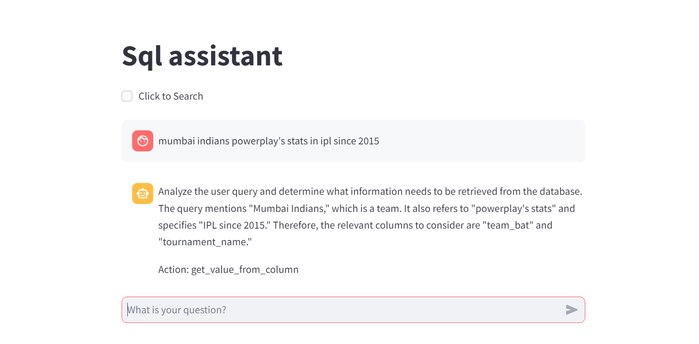
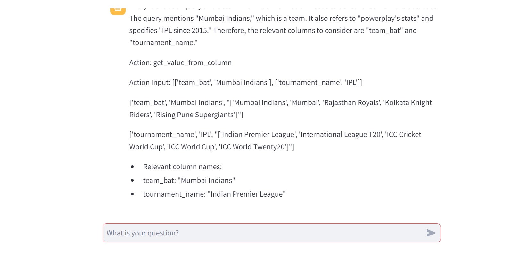
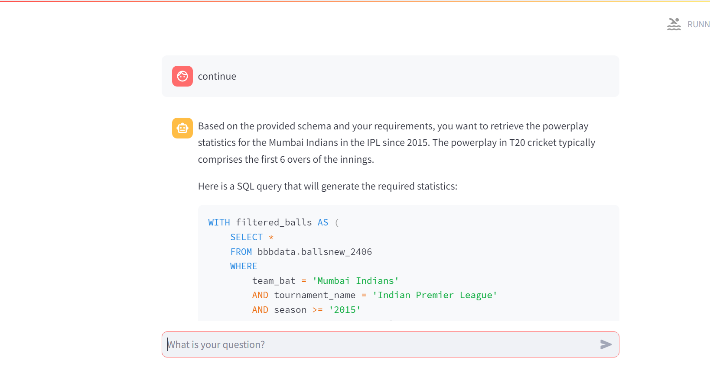
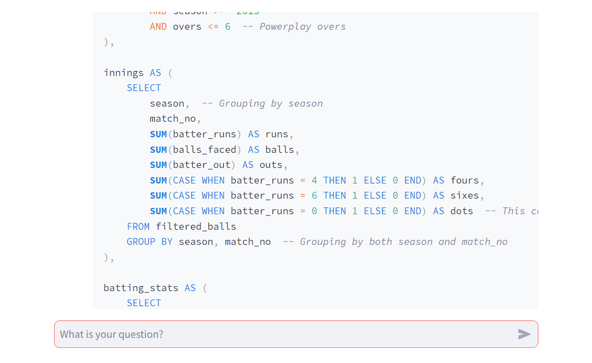
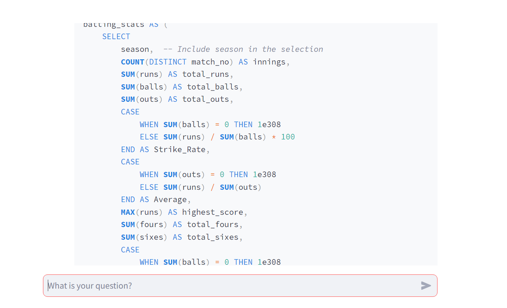
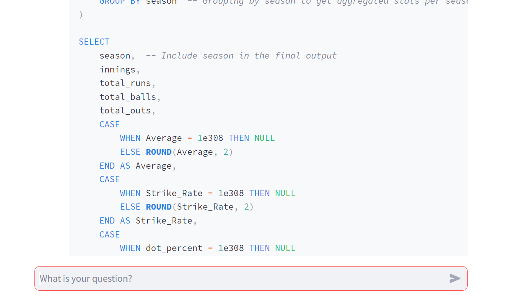
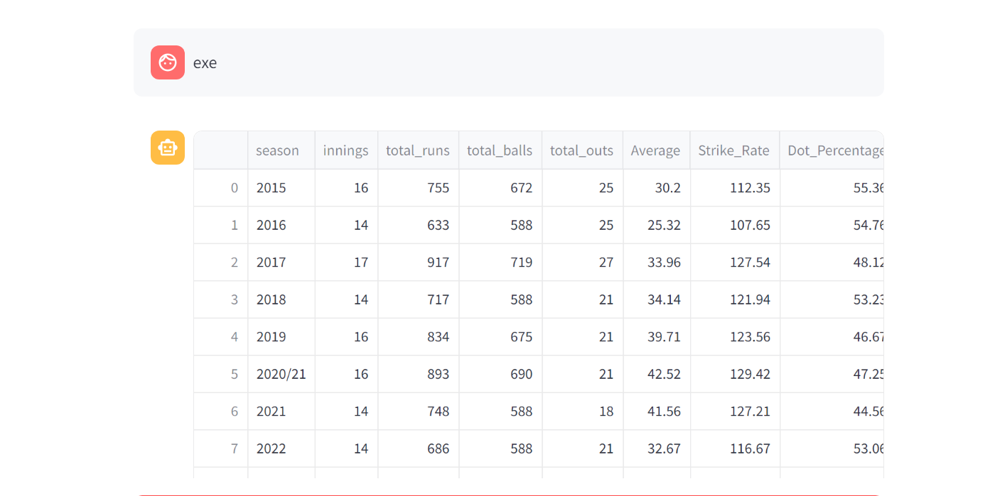

# About

This project features an intuitive AI-assisted SQL engine designed specifically for cricket data analysis. The engine simplifies the calculation of complex and granular statistics, enhancing the way cricket analytics are performed.

In layman terms, it's just ChatGPT with a SQL query executing capability in Google BigQuery with a searching agent. More complex queries/granular stats can be calculated by a human with basic SQL and cricket knowledge, as they can iterate/give feedback based on queries or the results generated from queries. Thus, it focuses on business logic (i.e., Cricket), not plumbing.

A similar project I had made is SQL Assistant, which uses LangGraph to generate stats/results following certain steps/stages iteratively rather than being chat-based.

Link: [https://github.com/adithya04dev/advanced-cricket-stats](https://github.com/adithya04dev/advanced-cricket-stats)

## Technologies/Packages Used

- **Langchain**: For the chat-based component of this system that can respond based on user suggestions. Also using Langchain tool calling agent (specifically ReAct) for preprocessing step in the initial phase.
- **SQL**: For data querying.
- **BigQuery**: Backend for executing SQL queries.

## Architecture

   ## Screenshots
  
  

